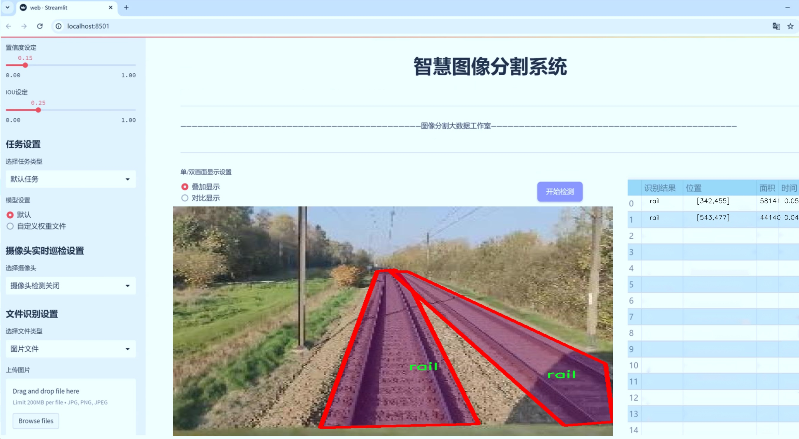
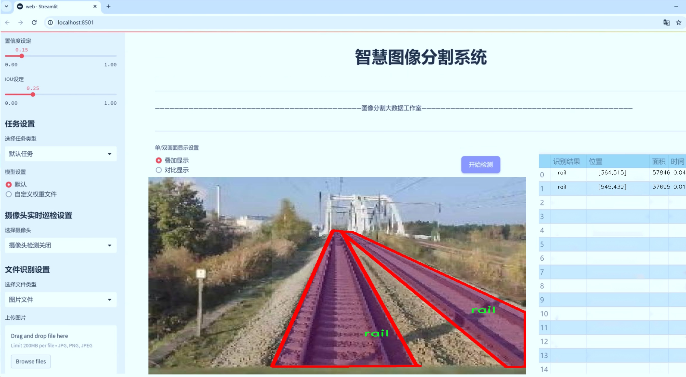
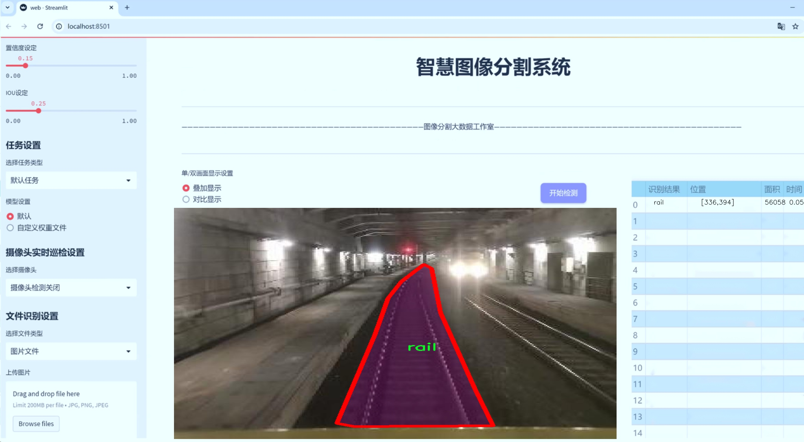
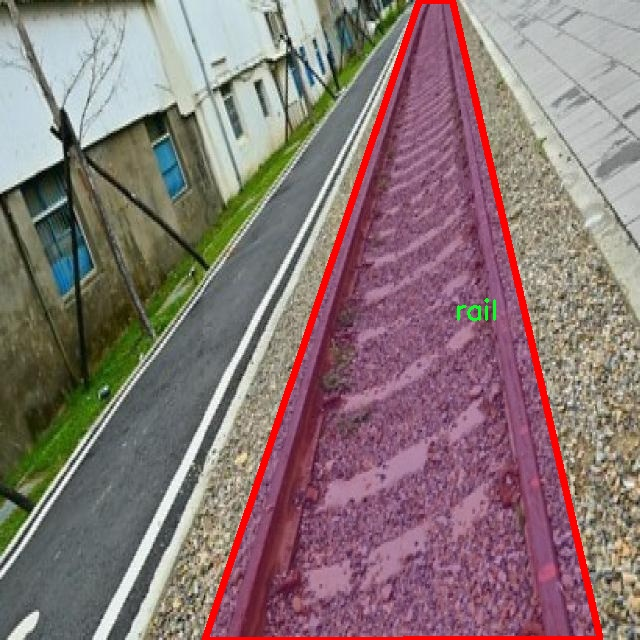
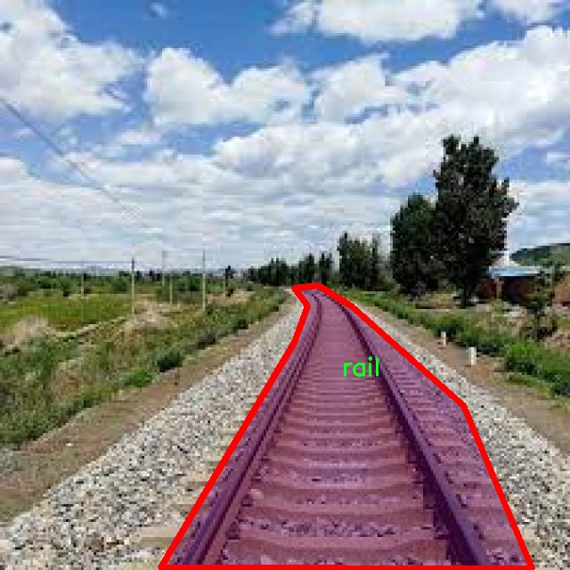
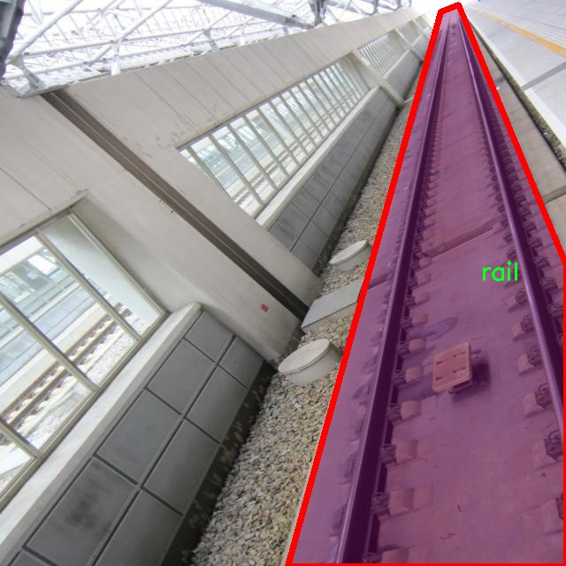
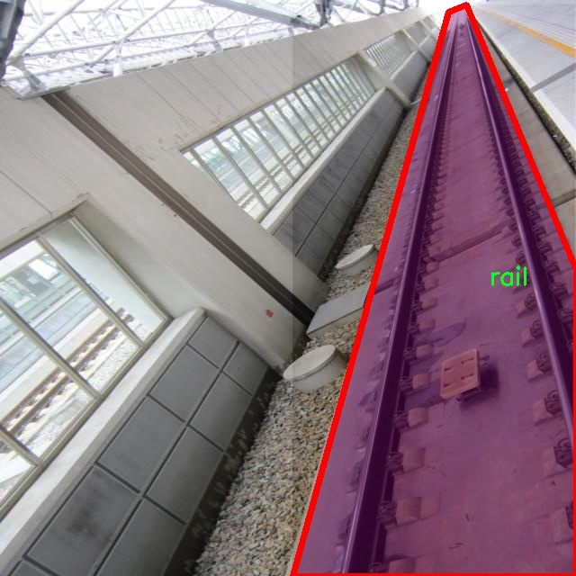
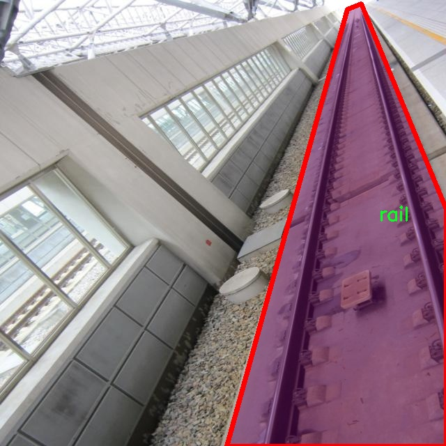

# 铁路轨道分割系统： yolov8-seg-C2f-EMSCP

### 1.研究背景与意义

[参考博客](https://gitee.com/YOLOv8_YOLOv11_Segmentation_Studio/projects)

[博客来源](https://kdocs.cn/l/cszuIiCKVNis)

研究背景与意义

随着城市化进程的加快，铁路运输作为一种高效、环保的交通方式，其重要性日益凸显。然而，铁路轨道的维护与管理面临着诸多挑战，尤其是在轨道的监测与检测方面。传统的人工检查方法不仅效率低下，而且容易受到人为因素的影响，导致漏检或误检现象的发生。因此，开发一种高效、准确的铁路轨道分割系统显得尤为重要。近年来，深度学习技术的迅猛发展为计算机视觉领域带来了新的机遇，尤其是在图像分割任务中，基于卷积神经网络（CNN）的实例分割方法逐渐成为研究热点。

YOLO（You Only Look Once）系列模型以其高效的实时检测能力和较好的准确性，广泛应用于目标检测和分割任务。YOLOv8作为该系列的最新版本，结合了多种先进的技术和优化策略，具备了更强的特征提取能力和更快的推理速度。然而，针对铁路轨道这一特定场景，YOLOv8的原始模型可能无法充分发挥其潜力。因此，基于改进YOLOv8的铁路轨道分割系统的研究具有重要的理论和实践意义。

本研究所使用的数据集“rail2”包含5800张铁路轨道图像，且仅有一个类别“rail”，为模型的训练和评估提供了丰富的样本基础。数据集的构建充分考虑了铁路轨道的多样性和复杂性，涵盖了不同光照、天气和环境条件下的轨道图像。这为模型的泛化能力和鲁棒性提供了良好的保障。通过对这些图像进行实例分割，能够有效提取出轨道的边界信息，为后续的轨道检测、维护和安全监测提供数据支持。

改进YOLOv8的铁路轨道分割系统不仅能够提高轨道检测的准确性，还能实现实时监测，为铁路运输的安全运营提供技术保障。该系统的应用前景广泛，涵盖了铁路运营管理、智能监控、无人机巡检等多个领域。通过自动化的轨道分割和分析，能够显著降低人工成本，提高工作效率，并减少因人为失误导致的安全隐患。

此外，本研究还将为深度学习在铁路行业的应用提供新的思路和方法，推动相关技术的进步。随着数据集的不断丰富和模型的不断优化，未来的铁路轨道分割系统将能够适应更复杂的场景，满足更高的精度要求，进而为智能交通系统的建设奠定基础。

综上所述，基于改进YOLOv8的铁路轨道分割系统的研究不仅具有重要的学术价值，也为实际应用提供了可行的解决方案。通过深入探讨该系统的设计与实现，将为铁路轨道的智能化管理开辟新的路径，推动铁路行业的数字化转型与升级。

### 2.图片演示







注意：本项目提供完整的训练源码数据集和训练教程,由于此博客编辑较早,暂不提供权重文件（best.pt）,需要按照6.训练教程进行训练后实现上图效果。

### 3.视频演示

[3.1 视频演示](https://www.bilibili.com/video/BV1146NYwEyG/)

### 4.数据集信息

##### 4.1 数据集类别数＆类别名

nc: 1
names: ['rail']


##### 4.2 数据集信息简介

数据集信息展示

在本研究中，我们采用了名为“rail2”的数据集，以支持对铁路轨道分割系统的训练，旨在改进YOLOv8-seg模型的性能。该数据集专门针对铁路轨道的检测与分割任务而设计，提供了高质量的标注数据，确保模型能够有效学习到轨道的特征。数据集的类别数量为1，具体类别为“rail”，这意味着数据集中所有的标注均围绕这一特定对象展开，确保了训练过程的专一性和针对性。

“rail2”数据集的构建考虑到了铁路轨道在不同环境和条件下的多样性，包含了多种场景下的轨道图像。这些图像可能来源于不同的天气条件、光照变化以及不同的地理位置，旨在增强模型的泛化能力。数据集中包含的图像不仅涵盖了轨道的全景视图，还包括了特写镜头，以便模型能够捕捉到轨道的细节特征。这种多样化的图像来源为模型提供了丰富的学习素材，使其能够在实际应用中更好地适应不同的场景。

在数据集的标注过程中，采用了精确的分割技术，确保每一幅图像中的轨道部分都被准确地标记出来。这种高质量的标注对于训练深度学习模型至关重要，因为它直接影响到模型的学习效果和最终的分割精度。通过对“rail”类别的深入标注，数据集为YOLOv8-seg模型提供了一个清晰的学习目标，使其能够在训练过程中有效地识别和分割出轨道区域。

此外，数据集的规模和多样性也为模型的训练提供了良好的基础。随着数据集的不断扩展，未来可以考虑引入更多的类别，例如不同类型的轨道、周边环境中的障碍物等，以进一步提升模型的应用范围和准确性。然而，在当前阶段，专注于“rail”这一单一类别的策略，有助于模型在特定任务上的深度学习，从而实现更高的分割精度。

为了进一步验证模型的性能，研究团队计划在训练完成后，使用独立的测试集对模型进行评估。通过与其他现有的轨道分割模型进行对比，分析“rail2”数据集在改进YOLOv8-seg模型中的有效性和优势。这一过程不仅能够揭示模型在实际应用中的表现，还能为未来的研究提供宝贵的经验和数据支持。

综上所述，“rail2”数据集为铁路轨道分割系统的研究提供了坚实的基础。通过精确的标注和多样化的图像来源，该数据集不仅提升了YOLOv8-seg模型的训练效果，也为铁路轨道的自动检测与维护提供了新的可能性。随着技术的不断进步，未来有望实现更高效、更智能的铁路轨道监测系统，为铁路运输的安全与效率提供保障。











### 5.项目依赖环境部署教程（零基础手把手教学）

[5.1 环境部署教程链接（零基础手把手教学）](https://www.bilibili.com/video/BV1jG4Ve4E9t/?vd_source=bc9aec86d164b67a7004b996143742dc)


[5.2 安装Python虚拟环境创建和依赖库安装视频教程链接（零基础手把手教学）](https://www.bilibili.com/video/BV1nA4VeYEze/?vd_source=bc9aec86d164b67a7004b996143742dc)

### 6.手把手YOLOV8-seg训练视频教程（零基础手把手教学）

[6.1 手把手YOLOV8-seg训练视频教程（零基础小白有手就能学会）](https://www.bilibili.com/video/BV1cA4VeYETe/?vd_source=bc9aec86d164b67a7004b996143742dc)


按照上面的训练视频教程链接加载项目提供的数据集，运行train.py即可开始训练



     Epoch   gpu_mem       box       obj       cls    labels  img_size
     1/200     0G   0.01576   0.01955  0.007536        22      1280: 100%|██████████| 849/849 [14:42<00:00,  1.04s/it]
               Class     Images     Labels          P          R     mAP@.5 mAP@.5:.95: 100%|██████████| 213/213 [01:14<00:00,  2.87it/s]
                 all       3395      17314      0.994      0.957      0.0957      0.0843

     Epoch   gpu_mem       box       obj       cls    labels  img_size
     2/200     0G   0.01578   0.01923  0.007006        22      1280: 100%|██████████| 849/849 [14:44<00:00,  1.04s/it]
               Class     Images     Labels          P          R     mAP@.5 mAP@.5:.95: 100%|██████████| 213/213 [01:12<00:00,  2.95it/s]
                 all       3395      17314      0.996      0.956      0.0957      0.0845

     Epoch   gpu_mem       box       obj       cls    labels  img_size
     3/200     0G   0.01561    0.0191  0.006895        27      1280: 100%|██████████| 849/849 [10:56<00:00,  1.29it/s]
               Class     Images     Labels          P          R     mAP@.5 mAP@.5:.95: 100%|███████   | 187/213 [00:52<00:00,  4.04it/s]
                 all       3395      17314      0.996      0.957      0.0957      0.0845


### 7.50+种全套YOLOV8-seg创新点加载调参实验视频教程（一键加载写好的改进模型的配置文件）

[7.1 50+种全套YOLOV8-seg创新点加载调参实验视频教程（一键加载写好的改进模型的配置文件）](https://www.bilibili.com/video/BV1Hw4VePEXv/?vd_source=bc9aec86d164b67a7004b996143742dc)

### YOLOV8-seg算法简介

原始YOLOV8-seg算法原理

YOLOV8-seg作为YOLO系列的最新发展，代表了目标检测和图像分割领域的一次重要进步。与传统的基于锚框的检测方法相比，YOLOV8-seg采用了更为先进的无锚框（anchor-free）策略，这一转变不仅提升了检测精度，还显著加快了检测速度。这种方法的核心在于通过直接回归目标的边界框和类别，从而简化了模型的设计和训练过程，减少了对手动设置锚框的依赖，使得模型在多种复杂场景下表现更加优异。

YOLOV8-seg的网络结构主要由四个模块组成：输入端、主干网络、Neck端和输出端。输入端负责对输入图像进行预处理，包括Mosaic数据增强、自适应图像缩放和灰度填充等操作，以增强模型的鲁棒性和适应性。主干网络则通过卷积、池化等操作提取图像特征，采用了C2f模块和SPPF结构，旨在提高特征提取的效率和准确性。Neck端基于路径聚合网络（PAN）结构，通过上下采样和特征拼接的方式融合不同尺度的特征图，以便更好地捕捉目标的多尺度信息。最后，输出端采用解耦头结构，实现了分类和回归过程的分离，优化了正负样本的匹配和损失计算。

在YOLOV8-seg中，模型的训练和损失计算策略也得到了显著改进。它采用了任务对齐分配器（Task-Aligned Assigner）方法，通过对分类分数和回归分数进行加权，提升了样本匹配的准确性。此外，分类损失采用了二元交叉熵（BCE）计算，而回归损失则使用了分布聚焦损失（DFL）和完美交并比损失（CIoU），这使得模型在边界框回归时更加精确，能够有效地处理复杂的目标形态。

尽管YOLOV8-seg在多方面展现了优越性，但在特定应用场景中，尤其是在复杂水面环境下，仍然面临着一些挑战。小目标漂浮物的特征复杂且背景多样，导致了模型在定位和目标感知能力上的不足。为了解决这些问题，YOLOV8-seg的改进版本——YOLOV8-WSSOD应运而生。该版本在原有基础上引入了BiFormer双层路由注意力机制，构建了C2fBF模块，以捕获远程依赖关系，减轻主干网络下采样过程中的噪声影响，从而保留更细粒度的上下文信息。

此外，YOLOV8-WSSOD还针对小目标漏检问题，添加了一个更小的检测头，以提升网络对小目标的感知能力。通过在Neck端引入GSConv和Slim-neck技术，模型在保持精度的同时有效降低了计算量，进一步提高了检测效率。最后，使用MPDIoU损失函数替换CIoU损失函数，增强了模型的泛化能力和精准度，使得YOLOV8-WSSOD在复杂环境下的表现更加出色。

YOLOV8-seg及其改进版本的成功，不仅在于其高效的网络结构和优化的损失计算策略，更在于其对实际应用场景的深刻理解和针对性改进。通过不断的创新和优化，YOLOV8-seg在目标检测和图像分割领域中展现出了强大的生命力，成为了研究者和工程师们在智能视觉系统中不可或缺的工具。未来，随着技术的不断进步，YOLO系列算法有望在更多复杂场景中发挥更大的作用，推动目标检测和图像分割技术的进一步发展。


### 9.系统功能展示（检测对象为举例，实际内容以本项目数据集为准）

图9.1.系统支持检测结果表格显示

  图9.2.系统支持置信度和IOU阈值手动调节

  图9.3.系统支持自定义加载权重文件best.pt(需要你通过步骤5中训练获得)

  图9.4.系统支持摄像头实时识别

  图9.5.系统支持图片识别

  图9.6.系统支持视频识别

  图9.7.系统支持识别结果文件自动保存

  图9.8.系统支持Excel导出检测结果数据


### 10.50+种全套YOLOV8-seg创新点原理讲解（非科班也可以轻松写刊发刊，V11版本正在科研待更新）

#### 10.1 由于篇幅限制，每个创新点的具体原理讲解就不一一展开，具体见下列网址中的创新点对应子项目的技术原理博客网址【Blog】：


[10.1 50+种全套YOLOV8-seg创新点原理讲解链接](https://gitee.com/qunmasj/good)

#### 10.2 部分改进模块原理讲解(完整的改进原理见上图和技术博客链接)【如果此小节的图加载失败可以通过CSDN或者Github搜索该博客的标题访问原始博客，原始博客图片显示正常】
### 全维动态卷积ODConv
鉴于上述讨论，我们的ODConv引入了一种多维注意机制，该机制具有并行策略，用于学习卷积核在核空间的所有四个维度上的不同注意。图提供了CondConv、DyConv和ODConv的示意性比较。

ODConv的公式：根据等式1中的符号，ODConv可定义为


 将注意力标量分配给整个卷积核。图2示出了将这四种类型的关注乘以n个卷积核的过程。原则上，这四种类型的关注是相互补充的，并且以位置、信道、滤波器和核的顺序将它们逐步乘以卷积核 
 ，使得卷积运算不同w.r.t.所有空间位置、所有输入信道、所有滤波器和输入x的所有核，提供捕获丰富上下文线索的性能保证。因此，ODConv可以显著增强CNN基本卷积运算的特征提取能力。此外，具有单个卷积核的ODConv可以与标准CondConv和DyConv竞争或优于它们，为最终模型引入的额外参数大大减少。提供了大量实验来验证这些优点。通过比较等式1和等式2，我们可以清楚地看到，ODConv是一种更广义的动态卷积。此外，当设置n=1且 所有分量均为1时，只关注滤波器方向 的ODConv将减少为：将基于输入特征的SE变量应用于卷积滤波器，然后进行卷积运算（注意原始SE（Hu等人，2018b）基于输出特征，并且用于重新校准输出特征本身）。这种SE变体是ODConv的特例。


图：将ODConv中的四种注意类型逐步乘以卷积核的示例。（a） 沿空间维度的逐位置乘法运算，（b）沿输入信道维度的逐信道乘法运算、（c）沿输出信道维度的按滤波器乘法运算，以及（d）沿卷积核空间的核维度的按核乘法运算。方法部分对符号进行了说明
实现：对于ODConv，一个关键问题是如何计算卷积核的四种关注度 。继CondConv和DyConv之后，我们还使用SE型注意力模块（Hu等人，2018b），但将多个头部作为来计算它们，其结构如图所示。具体而言，首先通过逐通道全局平均池（GAP）运算将输入压缩到具有长度的特征向量中。随后，存在完全连接（FC）层和四个头部分支。ReLU（Krizhevsky等人，2012）位于FC层之后。FC层将压缩特征向量映射到具有缩减比的低维空间（根据消融实验，我们在所有主要实验中设置 ，避免了高模型复杂度）。对于四个头部分支，每个分支都有一个输出大小如图。

### 引入ODConv的改进YOLO
参考这篇博客涵盖了引入ODConv的改进YOLOv8系统的内容，ODConv采用多维注意机制，在卷积核空间的四个维度上学习不同的注意。结合了CondConv和DyConv的优势，ODConv通过图示的四种注意类型逐步与卷积核相乘，以捕获丰富的上下文线索，提升特征提取能力。

#### ODConv结构与方法
ODConv的公式和图示展示了其关注力分配给卷积核的方式，其中四种类型的关注以位置、信道、滤波器和核的顺序逐步与卷积核相乘。这种结构保证了卷积运算不同于标准的Conv操作，能够捕获更多上下文信息，从而增强了CNN的特征提取能力。另外，单个卷积核的ODConv在性能上能够与CondConv和DyConv相竞争，并且引入的额外参数大幅减少。

ODConv的特殊之处在于其广义的动态卷积性质，同时在特定条件下（n=1且所有分量为1），它可以退化为一种特例，即只关注滤波器方向，这类似于基于输入特征的SE变体，但不同于原始SE，它基于输出特征。

#### ODConv的实现
关键问题在于如何计算卷积核的四种关注度。ODConv采用了SE型注意力模块，结合了多个头部来计算这些关注度。具体实现上，通过逐通道全局平均池运算和完全连接层，将输入压缩为特征向量，随后使用四个头部分支来计算四种不同类型的关注。这样的结构能在保持模型复杂度可控的情况下，提升了特征的表征能力。

ODConv的引入为YOLOv8带来了显著的性能提升，并且通过大量实验证明了其在特征提取方面的优越性。其结合了多维注意机制和卷积操作，为目标检测和分拣系统的提升带来了新的思路和性能突破。


### 11.项目核心源码讲解（再也不用担心看不懂代码逻辑）

#### 11.1 ultralytics\utils\callbacks\base.py

以下是经过简化和注释的核心代码部分，主要保留了回调函数和默认回调字典的定义：

```python
# Ultralytics YOLO 🚀, AGPL-3.0 license
"""基础回调函数定义模块。"""

from collections import defaultdict
from copy import deepcopy

# 训练回调函数定义 --------------------------------------------------------------------------------------------

def on_train_start(trainer):
    """训练开始时调用的回调函数。"""
    pass

def on_train_epoch_start(trainer):
    """每个训练周期开始时调用的回调函数。"""
    pass

def on_train_batch_start(trainer):
    """每个训练批次开始时调用的回调函数。"""
    pass

def on_train_batch_end(trainer):
    """每个训练批次结束时调用的回调函数。"""
    pass

def on_train_epoch_end(trainer):
    """每个训练周期结束时调用的回调函数。"""
    pass

def on_train_end(trainer):
    """训练结束时调用的回调函数。"""
    pass

# 默认回调字典，包含所有的回调函数 --------------------------------------------------------------------------------

default_callbacks = {
    'on_train_start': [on_train_start],  # 训练开始
    'on_train_epoch_start': [on_train_epoch_start],  # 训练周期开始
    'on_train_batch_start': [on_train_batch_start],  # 训练批次开始
    'on_train_batch_end': [on_train_batch_end],  # 训练批次结束
    'on_train_epoch_end': [on_train_epoch_end],  # 训练周期结束
    'on_train_end': [on_train_end],  # 训练结束
}

def get_default_callbacks():
    """
    返回一个默认回调字典的副本，字典的值为默认空列表。

    Returns:
        (defaultdict): 一个带有默认空列表的defaultdict。
    """
    return defaultdict(list, deepcopy(default_callbacks))

def add_integration_callbacks(instance):
    """
    将来自不同来源的集成回调添加到实例的回调字典中。

    Args:
        instance (Trainer, Predictor, Validator, Exporter): 一个具有'callbacks'属性的对象，该属性是一个回调列表的字典。
    """
    # 加载HUB回调
    from .hub import callbacks as hub_cb
    callbacks_list = [hub_cb]

    # 如果实例是Trainer类型，加载其他训练回调
    if 'Trainer' in instance.__class__.__name__:
        from .clearml import callbacks as clear_cb
        from .comet import callbacks as comet_cb
        from .dvc import callbacks as dvc_cb
        from .mlflow import callbacks as mlflow_cb
        from .neptune import callbacks as neptune_cb
        from .raytune import callbacks as tune_cb
        from .tensorboard import callbacks as tb_cb
        from .wb import callbacks as wb_cb
        callbacks_list.extend([clear_cb, comet_cb, dvc_cb, mlflow_cb, neptune_cb, tune_cb, tb_cb, wb_cb])

    # 将回调添加到实例的回调字典中
    for callbacks in callbacks_list:
        for k, v in callbacks.items():
            if v not in instance.callbacks[k]:
                instance.callbacks[k].append(v)
```

### 代码说明：
1. **回调函数**：定义了一系列的回调函数，这些函数在训练、验证和预测的不同阶段被调用。每个函数目前都是空的，实际使用时可以根据需要填充具体逻辑。
  
2. **默认回调字典**：`default_callbacks` 字典中存储了各个阶段的回调函数，便于在训练过程中调用。

3. **获取默认回调**：`get_default_callbacks` 函数返回一个包含默认回调的字典，使用 `defaultdict` 确保每个键都有一个空列表作为默认值。

4. **添加集成回调**：`add_integration_callbacks` 函数用于将来自不同库的回调集成到指定的实例中，支持多种回调的扩展。

这个文件是Ultralytics YOLO项目中的一个回调函数基础模块，主要用于定义和管理训练、验证、预测和导出过程中的各种回调函数。回调函数是一种在特定事件发生时自动调用的函数，通常用于监控和控制程序的执行流程。

文件中首先导入了`defaultdict`和`deepcopy`，前者用于创建一个字典，默认值为列表，后者用于深拷贝对象。接下来，文件定义了一系列回调函数，这些函数在不同的训练和验证阶段被调用。每个回调函数的实现目前都是空的，表示在这些阶段没有特定的操作。

回调函数分为几个部分：

1. **训练回调**：包括在预训练开始和结束、训练开始、每个训练周期和批次开始和结束、优化器步骤、梯度清零前、模型保存、训练结束等时刻被调用的函数。这些回调函数可以用于记录训练过程中的信息、调整学习率、保存模型等。

2. **验证回调**：在验证开始、每个验证批次开始和结束、验证结束时被调用。这些回调函数可以用于监控验证过程的性能。

3. **预测回调**：在预测开始、每个预测批次开始和结束、后处理结束、预测结束时被调用。这些回调函数可以用于处理模型的预测结果。

4. **导出回调**：在模型导出开始和结束时被调用，通常用于处理模型的导出过程。

接下来，文件定义了一个`default_callbacks`字典，包含了所有的回调函数，按类别组织。这使得在实际使用时，可以方便地调用这些回调。

`get_default_callbacks`函数返回一个深拷贝的`default_callbacks`字典，确保在使用时不会修改原始字典的内容。

`add_integration_callbacks`函数用于将来自不同来源的集成回调添加到给定实例的回调字典中。它首先加载一些特定的回调模块，然后根据实例的类型（如Trainer、Predictor等）决定加载哪些回调。最后，将这些回调添加到实例的回调字典中，确保可以在相应的时刻调用。

总的来说，这个文件为Ultralytics YOLO的训练、验证、预测和导出过程提供了一个灵活的回调机制，使得用户可以在不同的阶段插入自定义的操作，从而更好地控制和监控模型的训练和使用过程。

#### 11.2 ultralytics\models\nas\model.py

以下是经过简化和注释的代码，保留了核心部分并添加了详细的中文注释：

```python
# 导入必要的库
from pathlib import Path
import torch
from ultralytics.engine.model import Model
from ultralytics.utils.torch_utils import model_info, smart_inference_mode
from .predict import NASPredictor
from .val import NASValidator

class NAS(Model):
    """
    YOLO NAS模型用于目标检测。

    该类提供了YOLO-NAS模型的接口，并扩展了Ultralytics引擎中的`Model`类。
    旨在通过预训练或自定义训练的YOLO-NAS模型来简化目标检测任务。
    """

    def __init__(self, model='yolo_nas_s.pt') -> None:
        """初始化NAS模型，使用提供的模型或默认的'yolo_nas_s.pt'模型。"""
        # 确保提供的模型不是YAML配置文件
        assert Path(model).suffix not in ('.yaml', '.yml'), 'YOLO-NAS模型仅支持预训练模型。'
        # 调用父类构造函数
        super().__init__(model, task='detect')

    @smart_inference_mode()
    def _load(self, weights: str, task: str):
        """加载现有的NAS模型权重，或如果未提供，则创建一个新的NAS模型并使用预训练权重。"""
        import super_gradients
        suffix = Path(weights).suffix
        # 根据权重文件后缀加载模型
        if suffix == '.pt':
            self.model = torch.load(weights)  # 加载.pt文件
        elif suffix == '':
            self.model = super_gradients.training.models.get(weights, pretrained_weights='coco')  # 获取预训练模型

        # 标准化模型
        self.model.fuse = lambda verbose=True: self.model  # 融合模型
        self.model.stride = torch.tensor([32])  # 设置步幅
        self.model.names = dict(enumerate(self.model._class_names))  # 设置类别名称
        self.model.is_fused = lambda: False  # 用于信息查询
        self.model.yaml = {}  # 用于信息查询
        self.model.pt_path = weights  # 导出时使用的权重路径
        self.model.task = 'detect'  # 设置任务类型为检测

    def info(self, detailed=False, verbose=True):
        """
        记录模型信息。

        参数:
            detailed (bool): 是否显示模型的详细信息。
            verbose (bool): 控制输出的详细程度。
        """
        return model_info(self.model, detailed=detailed, verbose=verbose, imgsz=640)

    @property
    def task_map(self):
        """返回任务与相应预测器和验证器类的映射字典。"""
        return {'detect': {'predictor': NASPredictor, 'validator': NASValidator}}
```

### 代码说明：
1. **导入部分**：导入了必要的库和模块，主要用于模型的构建和处理。
2. **NAS类**：继承自`Model`类，提供YOLO-NAS模型的接口。
3. **初始化方法**：确保传入的模型文件不是YAML格式，并调用父类的初始化方法。
4. **加载模型权重**：根据权重文件的后缀加载模型，支持`.pt`文件和预训练模型的获取。
5. **模型信息记录**：提供获取模型信息的功能，可以选择详细程度和输出的详细性。
6. **任务映射**：定义了任务与相应的预测器和验证器类的映射关系。

这个程序文件是Ultralytics YOLO（You Only Look Once）模型的一部分，主要实现了YOLO-NAS模型的接口。YOLO-NAS是一种用于目标检测的深度学习模型，文件中的代码定义了一个名为`NAS`的类，该类继承自Ultralytics引擎中的`Model`类，旨在简化使用预训练或自定义训练的YOLO-NAS模型进行目标检测的过程。

在文件开头，有一个示例代码，展示了如何导入`NAS`类并使用它来加载模型和进行预测。用户可以通过传入模型名称（如'yolo_nas_s'）来创建模型实例，并使用`predict`方法对图像进行预测。

`NAS`类的构造函数`__init__`接受一个参数`model`，默认值为'yolo_nas_s.pt'，用于指定预训练模型的路径。构造函数中有一个断言，确保传入的模型路径后缀不是.yaml或.yml，因为YOLO-NAS模型只支持预训练模型，不支持YAML配置文件。

`_load`方法用于加载模型权重。如果传入的权重文件是以.pt结尾，使用`torch.load`加载模型；如果没有后缀，则通过`super_gradients`库获取预训练模型。该方法还对模型进行了一些标准化处理，例如设置模型的步幅、类别名称等。

`info`方法用于记录模型的信息，用户可以选择是否显示详细信息和控制输出的详细程度。

最后，`task_map`属性返回一个字典，将任务映射到相应的预测器和验证器类，这里主要是将目标检测任务映射到`NASPredictor`和`NASValidator`类。

总的来说，这个文件为YOLO-NAS模型提供了一个简洁的接口，使得用户能够方便地加载模型并进行目标检测。

#### 11.3 ultralytics\models\yolo\pose\train.py

以下是经过简化和注释的核心代码部分：

```python
# 导入必要的库和模块
from copy import copy
from ultralytics.models import yolo
from ultralytics.nn.tasks import PoseModel
from ultralytics.utils import DEFAULT_CFG, LOGGER
from ultralytics.utils.plotting import plot_images, plot_results

class PoseTrainer(yolo.detect.DetectionTrainer):
    """
    PoseTrainer类，继承自DetectionTrainer，用于基于姿态模型的训练。
    """

    def __init__(self, cfg=DEFAULT_CFG, overrides=None, _callbacks=None):
        """初始化PoseTrainer对象，设置配置和覆盖参数。"""
        if overrides is None:
            overrides = {}
        overrides['task'] = 'pose'  # 设置任务类型为姿态估计
        super().__init__(cfg, overrides, _callbacks)  # 调用父类构造函数

        # 检查设备类型，如果是Apple MPS，给出警告
        if isinstance(self.args.device, str) and self.args.device.lower() == 'mps':
            LOGGER.warning("WARNING ⚠️ Apple MPS known Pose bug. Recommend 'device=cpu' for Pose models.")

    def get_model(self, cfg=None, weights=None, verbose=True):
        """获取姿态估计模型，使用指定的配置和权重。"""
        # 创建PoseModel实例
        model = PoseModel(cfg, ch=3, nc=self.data['nc'], data_kpt_shape=self.data['kpt_shape'], verbose=verbose)
        if weights:
            model.load(weights)  # 加载权重

        return model  # 返回模型

    def set_model_attributes(self):
        """设置PoseModel的关键点形状属性。"""
        super().set_model_attributes()  # 调用父类方法
        self.model.kpt_shape = self.data['kpt_shape']  # 设置关键点形状

    def get_validator(self):
        """返回PoseValidator类的实例，用于验证。"""
        self.loss_names = 'box_loss', 'pose_loss', 'kobj_loss', 'cls_loss', 'dfl_loss'  # 定义损失名称
        return yolo.pose.PoseValidator(self.test_loader, save_dir=self.save_dir, args=copy(self.args))  # 返回验证器实例

    def plot_training_samples(self, batch, ni):
        """绘制一批训练样本，包括类别标签、边界框和关键点。"""
        images = batch['img']  # 获取图像
        kpts = batch['keypoints']  # 获取关键点
        cls = batch['cls'].squeeze(-1)  # 获取类别
        bboxes = batch['bboxes']  # 获取边界框
        paths = batch['im_file']  # 获取图像文件路径
        batch_idx = batch['batch_idx']  # 获取批次索引
        
        # 绘制图像
        plot_images(images,
                    batch_idx,
                    cls,
                    bboxes,
                    kpts=kpts,
                    paths=paths,
                    fname=self.save_dir / f'train_batch{ni}.jpg',  # 保存文件名
                    on_plot=self.on_plot)  # 是否在绘图时显示

    def plot_metrics(self):
        """绘制训练和验证的指标。"""
        plot_results(file=self.csv, pose=True, on_plot=self.on_plot)  # 保存结果图像
```

### 代码说明：
1. **PoseTrainer类**：该类专门用于姿态估计的训练，继承自YOLO的检测训练器。
2. **初始化方法**：设置任务类型为姿态估计，并处理设备类型的警告。
3. **获取模型**：根据配置和权重创建姿态模型实例。
4. **设置模型属性**：设置模型的关键点形状属性。
5. **获取验证器**：返回用于验证的PoseValidator实例，并定义损失名称。
6. **绘制训练样本**：将训练样本的图像、关键点、类别和边界框绘制出来并保存。
7. **绘制指标**：绘制训练和验证过程中的指标结果。

这个程序文件是Ultralytics YOLO模型库中的一个用于姿态估计训练的模块，文件名为`train.py`。它主要定义了一个名为`PoseTrainer`的类，该类继承自`DetectionTrainer`，并专门用于姿态模型的训练。

在文件的开头，导入了一些必要的模块和类，包括`yolo`模块、`PoseModel`类、一些默认配置和日志记录工具。接着，`PoseTrainer`类的文档字符串提供了使用示例，展示了如何实例化和使用该类进行训练。

`PoseTrainer`类的构造函数`__init__`接收配置参数`cfg`、覆盖参数`overrides`和回调函数`_callbacks`。如果没有提供覆盖参数，则初始化为空字典。它将任务类型设置为'pose'，并调用父类的构造函数进行初始化。同时，如果设备类型为'MPS'（苹果的金属性能着色器），则会发出警告，建议使用'cpu'设备进行姿态模型的训练。

`get_model`方法用于获取姿态估计模型。它根据提供的配置和权重初始化`PoseModel`，并在需要时加载权重。该方法返回初始化后的模型实例。

`set_model_attributes`方法用于设置模型的关键点形状属性，确保模型能够正确处理数据集中定义的关键点形状。

`get_validator`方法返回一个`PoseValidator`实例，用于模型验证。它定义了损失名称，包括边界框损失、姿态损失、关键对象损失、类别损失和分布式焦点损失。

`plot_training_samples`方法用于绘制一批训练样本，显示带有注释的类别标签、边界框和关键点。它从输入的批次中提取图像、关键点、类别和边界框信息，并调用`plot_images`函数进行可视化。

最后，`plot_metrics`方法用于绘制训练和验证过程中的指标，调用`plot_results`函数并保存结果图像。

总体而言，这个文件提供了一个结构化的方式来训练姿态估计模型，涵盖了模型的初始化、训练样本的可视化以及训练过程中的指标记录等功能。

#### 11.4 ultralytics\utils\dist.py

以下是代码中最核心的部分，并附上详细的中文注释：

```python
import os
import re
import shutil
import socket
import sys
import tempfile
from pathlib import Path

def find_free_network_port() -> int:
    """
    查找本地主机上可用的端口。

    在单节点训练时，如果不想连接到真实的主节点，但需要设置
    `MASTER_PORT` 环境变量，这个函数非常有用。
    """
    with socket.socket(socket.AF_INET, socket.SOCK_STREAM) as s:
        s.bind(('127.0.0.1', 0))  # 绑定到本地地址和随机端口
        return s.getsockname()[1]  # 返回分配的端口号


def generate_ddp_file(trainer):
    """生成 DDP 文件并返回其文件名。"""
    # 获取训练器的模块名和类名
    module, name = f'{trainer.__class__.__module__}.{trainer.__class__.__name__}'.rsplit('.', 1)

    # 构建文件内容
    content = f'''overrides = {vars(trainer.args)} \nif __name__ == "__main__":
    from {module} import {name}
    from ultralytics.utils import DEFAULT_CFG_DICT

    cfg = DEFAULT_CFG_DICT.copy()
    cfg.update(save_dir='')   # 处理额外的键 'save_dir'
    trainer = {name}(cfg=cfg, overrides=overrides)
    trainer.train()'''
    
    # 创建 DDP 目录（如果不存在）
    (USER_CONFIG_DIR / 'DDP').mkdir(exist_ok=True)
    
    # 创建临时文件并写入内容
    with tempfile.NamedTemporaryFile(prefix='_temp_',
                                     suffix=f'{id(trainer)}.py',
                                     mode='w+',
                                     encoding='utf-8',
                                     dir=USER_CONFIG_DIR / 'DDP',
                                     delete=False) as file:
        file.write(content)  # 写入内容到临时文件
    return file.name  # 返回临时文件的名称


def generate_ddp_command(world_size, trainer):
    """生成并返回用于分布式训练的命令。"""
    import __main__  # 本地导入以避免某些问题
    if not trainer.resume:
        shutil.rmtree(trainer.save_dir)  # 如果不恢复训练，删除保存目录
    
    file = str(Path(sys.argv[0]).resolve())  # 获取当前脚本的绝对路径
    safe_pattern = re.compile(r'^[a-zA-Z0-9_. /\\-]{1,128}$')  # 允许的字符和最大长度限制
    # 检查文件名是否合法，且文件存在且以 .py 结尾
    if not (safe_pattern.match(file) and Path(file).exists() and file.endswith('.py')):
        file = generate_ddp_file(trainer)  # 生成 DDP 文件
    
    # 根据 PyTorch 版本选择分布式命令
    dist_cmd = 'torch.distributed.run' if TORCH_1_9 else 'torch.distributed.launch'
    port = find_free_network_port()  # 查找可用端口
    # 构建命令
    cmd = [sys.executable, '-m', dist_cmd, '--nproc_per_node', f'{world_size}', '--master_port', f'{port}', file]
    return cmd, file  # 返回命令和文件名


def ddp_cleanup(trainer, file):
    """如果创建了临时文件，则删除它。"""
    if f'{id(trainer)}.py' in file:  # 检查文件名中是否包含临时文件的后缀
        os.remove(file)  # 删除临时文件
```

### 代码核心功能概述：
1. **查找可用端口**：`find_free_network_port` 函数用于查找本地主机上可用的网络端口，以便在分布式训练中使用。
2. **生成 DDP 文件**：`generate_ddp_file` 函数根据训练器的配置生成一个 Python 文件，用于分布式训练。
3. **生成分布式训练命令**：`generate_ddp_command` 函数根据训练器和世界大小生成分布式训练的命令。
4. **清理临时文件**：`ddp_cleanup` 函数用于删除在训练过程中生成的临时文件。

这个程序文件 `ultralytics/utils/dist.py` 主要用于支持分布式训练，特别是在使用 Ultralytics YOLO 框架时。文件中包含了几个重要的函数，分别用于查找可用的网络端口、生成分布式数据并行（DDP）文件、生成分布式训练命令以及清理临时文件。

首先，`find_free_network_port` 函数用于查找本地主机上可用的网络端口。它通过创建一个 TCP 套接字并绑定到一个随机端口来实现，返回的端口可以用于设置环境变量 `MASTER_PORT`，以便在单节点训练时不需要连接到真实的主节点。

接下来，`generate_ddp_file` 函数用于生成一个 DDP 文件并返回其文件名。该函数首先获取训练器的类模块和名称，然后构建一个 Python 脚本的内容，该脚本包含了训练器的配置和训练逻辑。生成的文件会被保存在用户配置目录下的 `DDP` 文件夹中，确保文件的唯一性和临时性。

`generate_ddp_command` 函数则用于生成分布式训练的命令。它首先检查训练器是否需要恢复训练，如果不需要，则删除保存目录。接着，它获取当前脚本的路径，并使用正则表达式验证该路径的安全性。如果路径不符合要求，则调用 `generate_ddp_file` 生成一个新的 DDP 文件。然后，函数确定使用的分布式命令（根据 PyTorch 版本选择 `torch.distributed.run` 或 `torch.distributed.launch`），并调用 `find_free_network_port` 获取一个可用的端口。最终，返回一个包含命令和文件名的列表。

最后，`ddp_cleanup` 函数用于清理临时文件。如果生成的临时文件的后缀与训练器的 ID 匹配，则删除该文件，以避免在训练结束后留下不必要的临时文件。

总体来说，这个文件为 Ultralytics YOLO 框架提供了分布式训练的支持，确保在训练过程中能够动态生成所需的配置和命令，并进行必要的清理工作。

#### 11.5 ultralytics\trackers\track.py

以下是经过简化和详细注释的核心代码部分：

```python
# 导入必要的库
from functools import partial
import torch
from ultralytics.utils import IterableSimpleNamespace, yaml_load
from ultralytics.utils.checks import check_yaml
from .bot_sort import BOTSORT
from .byte_tracker import BYTETracker

# 定义跟踪器映射，方便根据名称获取对应的跟踪器类
TRACKER_MAP = {'bytetrack': BYTETracker, 'botsort': BOTSORT}

def on_predict_start(predictor, persist=False):
    """
    在预测开始时初始化对象跟踪器。

    参数:
        predictor (object): 预测器对象，用于初始化跟踪器。
        persist (bool, optional): 如果跟踪器已存在，是否保持它们。默认为 False。

    异常:
        AssertionError: 如果 tracker_type 不是 'bytetrack' 或 'botsort'。
    """
    # 如果预测器已经有跟踪器并且需要保持，则直接返回
    if hasattr(predictor, 'trackers') and persist:
        return
    
    # 检查并加载跟踪器配置
    tracker = check_yaml(predictor.args.tracker)
    cfg = IterableSimpleNamespace(**yaml_load(tracker))
    
    # 确保跟踪器类型是支持的类型
    assert cfg.tracker_type in ['bytetrack', 'botsort'], \
        f"只支持 'bytetrack' 和 'botsort'，但得到的是 '{cfg.tracker_type}'"
    
    # 初始化跟踪器列表
    trackers = []
    for _ in range(predictor.dataset.bs):  # 遍历批次大小
        # 根据配置创建对应的跟踪器实例
        tracker = TRACKER_MAP[cfg.tracker_type](args=cfg, frame_rate=30)
        trackers.append(tracker)  # 将跟踪器添加到列表中
    
    # 将跟踪器列表赋值给预测器
    predictor.trackers = trackers

def on_predict_postprocess_end(predictor):
    """后处理检测到的框并更新对象跟踪。"""
    bs = predictor.dataset.bs  # 批次大小
    im0s = predictor.batch[1]  # 获取原始图像数据
    for i in range(bs):
        det = predictor.results[i].boxes.cpu().numpy()  # 获取检测结果
        if len(det) == 0:  # 如果没有检测到目标，跳过
            continue
        
        # 更新跟踪器并获取跟踪结果
        tracks = predictor.trackers[i].update(det, im0s[i])
        if len(tracks) == 0:  # 如果没有跟踪到目标，跳过
            continue
        
        idx = tracks[:, -1].astype(int)  # 获取有效的索引
        predictor.results[i] = predictor.results[i][idx]  # 更新检测结果
        predictor.results[i].update(boxes=torch.as_tensor(tracks[:, :-1]))  # 更新框信息

def register_tracker(model, persist):
    """
    为模型注册跟踪回调，以便在预测期间进行对象跟踪。

    参数:
        model (object): 要注册跟踪回调的模型对象。
        persist (bool): 如果跟踪器已存在，是否保持它们。
    """
    # 注册预测开始时的回调
    model.add_callback('on_predict_start', partial(on_predict_start, persist=persist))
    # 注册预测后处理结束时的回调
    model.add_callback('on_predict_postprocess_end', on_predict_postprocess_end)
```

### 代码说明：
1. **导入模块**：导入必要的库和类，包括跟踪器和工具函数。
2. **跟踪器映射**：定义一个字典，将跟踪器名称映射到具体的跟踪器类，方便后续使用。
3. **`on_predict_start` 函数**：在预测开始时初始化跟踪器，检查配置文件，确保使用的跟踪器类型是支持的，并为每个批次创建跟踪器实例。
4. **`on_predict_postprocess_end` 函数**：在预测后处理阶段，更新检测到的目标框，并通过跟踪器进行目标跟踪，更新预测结果。
5. **`register_tracker` 函数**：将跟踪回调函数注册到模型中，以便在预测过程中自动调用。

这个程序文件是用于实现目标跟踪功能的，主要与Ultralytics YOLO模型相关。文件中导入了一些必要的库和模块，包括`torch`和一些Ultralytics的工具函数。文件的核心功能是定义了一些回调函数，用于在预测过程中初始化和更新目标跟踪器。

首先，文件定义了一个`TRACKER_MAP`字典，用于将跟踪器的名称映射到相应的类，支持的跟踪器有`BYTETracker`和`BOTSORT`。接下来，定义了`on_predict_start`函数，该函数在预测开始时被调用，用于初始化跟踪器。函数接受两个参数：`predictor`（预测器对象）和`persist`（一个布尔值，指示是否保留已存在的跟踪器）。如果预测器已经有跟踪器并且`persist`为真，则直接返回。否则，函数会检查配置文件中指定的跟踪器类型，并确保它是支持的类型之一。如果检查通过，函数会为每个批次的样本创建相应的跟踪器实例，并将其存储在预测器的`trackers`属性中。

接着，定义了`on_predict_postprocess_end`函数，该函数在预测后处理结束时被调用。它的作用是对检测到的目标框进行后处理，并更新目标跟踪信息。函数首先获取批次大小和输入图像，然后遍历每个样本，提取检测结果。如果没有检测到目标，函数会跳过该样本。对于检测到的目标，调用相应的跟踪器的`update`方法来更新跟踪信息。如果有有效的跟踪结果，函数会根据跟踪结果更新预测器的结果，确保只保留有效的目标框。

最后，文件定义了`register_tracker`函数，用于将跟踪回调函数注册到模型中。该函数接受两个参数：`model`（模型对象）和`persist`（布尔值，指示是否保留已存在的跟踪器）。函数通过`add_callback`方法将`on_predict_start`和`on_predict_postprocess_end`回调函数注册到模型中，以便在预测过程中自动调用这些函数进行目标跟踪。

总体来说，这个文件的主要功能是为Ultralytics YOLO模型提供目标跟踪的支持，通过回调机制在预测的不同阶段初始化和更新跟踪器。

### 12.系统整体结构（节选）

### 程序整体功能和构架概括

Ultralytics YOLO项目是一个用于目标检测和姿态估计的深度学习框架，提供了多种模型和工具，以便用户能够方便地进行训练、验证和推理。该框架的设计采用了模块化的结构，使得各个功能模块相互独立又能够协同工作。主要功能包括：

1. **回调机制**：通过回调函数管理训练和验证过程中的各种操作，允许用户在特定事件发生时插入自定义逻辑。
2. **模型管理**：提供了加载和使用不同类型的YOLO模型（如YOLO-NAS和姿态估计模型）的接口。
3. **分布式训练支持**：实现了分布式训练的配置和命令生成，支持多GPU训练。
4. **目标跟踪**：提供了目标跟踪的功能，通过回调机制在预测过程中初始化和更新跟踪器。

以下是每个文件的功能整理表格：

| 文件路径                                       | 功能描述                                                                                   |
|-----------------------------------------------|------------------------------------------------------------------------------------------|
| `ultralytics/utils/callbacks/base.py`       | 定义了回调函数的基础结构，管理训练、验证、预测和导出过程中的各种回调，支持用户自定义操作。       |
| `ultralytics/models/nas/model.py`            | 提供了YOLO-NAS模型的接口，支持模型的加载和预测，简化了使用预训练或自定义训练的过程。         |
| `ultralytics/models/yolo/pose/train.py`      | 实现了姿态估计模型的训练逻辑，包含模型初始化、训练样本可视化和训练过程中的指标记录等功能。   |
| `ultralytics/utils/dist.py`                  | 支持分布式训练，提供查找可用网络端口、生成DDP文件和命令、清理临时文件等功能。               |
| `ultralytics/trackers/track.py`              | 实现了目标跟踪功能，通过回调机制在预测过程中初始化和更新跟踪器，支持多种跟踪算法。         |

这个表格总结了各个文件的主要功能，帮助理解Ultralytics YOLO项目的整体架构和各个模块之间的关系。

### 13.图片、视频、摄像头图像分割Demo(去除WebUI)代码

在这个博客小节中，我们将讨论如何在不使用WebUI的情况下，实现图像分割模型的使用。本项目代码已经优化整合，方便用户将分割功能嵌入自己的项目中。
核心功能包括图片、视频、摄像头图像的分割，ROI区域的轮廓提取、类别分类、周长计算、面积计算、圆度计算以及颜色提取等。
这些功能提供了良好的二次开发基础。

### 核心代码解读

以下是主要代码片段，我们会为每一块代码进行详细的批注解释：

```python
import random
import cv2
import numpy as np
from PIL import ImageFont, ImageDraw, Image
from hashlib import md5
from model import Web_Detector
from chinese_name_list import Label_list

# 根据名称生成颜色
def generate_color_based_on_name(name):
    ......

# 计算多边形面积
def calculate_polygon_area(points):
    return cv2.contourArea(points.astype(np.float32))

...
# 绘制中文标签
def draw_with_chinese(image, text, position, font_size=20, color=(255, 0, 0)):
    image_pil = Image.fromarray(cv2.cvtColor(image, cv2.COLOR_BGR2RGB))
    draw = ImageDraw.Draw(image_pil)
    font = ImageFont.truetype("simsun.ttc", font_size, encoding="unic")
    draw.text(position, text, font=font, fill=color)
    return cv2.cvtColor(np.array(image_pil), cv2.COLOR_RGB2BGR)

# 动态调整参数
def adjust_parameter(image_size, base_size=1000):
    max_size = max(image_size)
    return max_size / base_size

# 绘制检测结果
def draw_detections(image, info, alpha=0.2):
    name, bbox, conf, cls_id, mask = info['class_name'], info['bbox'], info['score'], info['class_id'], info['mask']
    adjust_param = adjust_parameter(image.shape[:2])
    spacing = int(20 * adjust_param)

    if mask is None:
        x1, y1, x2, y2 = bbox
        aim_frame_area = (x2 - x1) * (y2 - y1)
        cv2.rectangle(image, (x1, y1), (x2, y2), color=(0, 0, 255), thickness=int(3 * adjust_param))
        image = draw_with_chinese(image, name, (x1, y1 - int(30 * adjust_param)), font_size=int(35 * adjust_param))
        y_offset = int(50 * adjust_param)  # 类别名称上方绘制，其下方留出空间
    else:
        mask_points = np.concatenate(mask)
        aim_frame_area = calculate_polygon_area(mask_points)
        mask_color = generate_color_based_on_name(name)
        try:
            overlay = image.copy()
            cv2.fillPoly(overlay, [mask_points.astype(np.int32)], mask_color)
            image = cv2.addWeighted(overlay, 0.3, image, 0.7, 0)
            cv2.drawContours(image, [mask_points.astype(np.int32)], -1, (0, 0, 255), thickness=int(8 * adjust_param))

            # 计算面积、周长、圆度
            area = cv2.contourArea(mask_points.astype(np.int32))
            perimeter = cv2.arcLength(mask_points.astype(np.int32), True)
            ......

            # 计算色彩
            mask = np.zeros(image.shape[:2], dtype=np.uint8)
            cv2.drawContours(mask, [mask_points.astype(np.int32)], -1, 255, -1)
            color_points = cv2.findNonZero(mask)
            ......

            # 绘制类别名称
            x, y = np.min(mask_points, axis=0).astype(int)
            image = draw_with_chinese(image, name, (x, y - int(30 * adjust_param)), font_size=int(35 * adjust_param))
            y_offset = int(50 * adjust_param)

            # 绘制面积、周长、圆度和色彩值
            metrics = [("Area", area), ("Perimeter", perimeter), ("Circularity", circularity), ("Color", color_str)]
            for idx, (metric_name, metric_value) in enumerate(metrics):
                ......

    return image, aim_frame_area

# 处理每帧图像
def process_frame(model, image):
    pre_img = model.preprocess(image)
    pred = model.predict(pre_img)
    det = pred[0] if det is not None and len(det)
    if det:
        det_info = model.postprocess(pred)
        for info in det_info:
            image, _ = draw_detections(image, info)
    return image

if __name__ == "__main__":
    cls_name = Label_list
    model = Web_Detector()
    model.load_model("./weights/yolov8s-seg.pt")

    # 摄像头实时处理
    cap = cv2.VideoCapture(0)
    while cap.isOpened():
        ret, frame = cap.read()
        if not ret:
            break
        ......

    # 图片处理
    image_path = './icon/OIP.jpg'
    image = cv2.imread(image_path)
    if image is not None:
        processed_image = process_frame(model, image)
        ......

    # 视频处理
    video_path = ''  # 输入视频的路径
    cap = cv2.VideoCapture(video_path)
    while cap.isOpened():
        ret, frame = cap.read()
        ......
```


### 14.完整训练+Web前端界面+50+种创新点源码、数据集获取


# [下载链接：https://mbd.pub/o/bread/Z5yVmZls](https://mbd.pub/o/bread/Z5yVmZls)